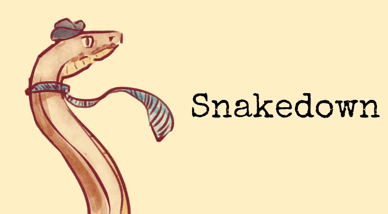

# Snakedown Docs 

A Batteries included [Zola](https://www.getzola.org) theme to use with [Snakedown](https://github.com/savente93/snakedown) for Python documentation.

Snakedown is a tool to extract signature and docstrings from your Python project and automatically generate an API documentation so that you can use it in your favourite static site generator (in this case Zola) to host your documentation. 

## Features

## Installation

## Usage & customisation

## Special Thanks
Thank you to:
- [@ghostcatte](https://www.patreon.com/c/ghostcatte/posts?vanity=ghostcatte) for the snek logo.
- [the PyData Community](https://pydata-sphinx-theme.readthedocs.io/en/stable/) as serving for the template (pun intended) for this theme
- [Astigmatic](https://fonts.google.com/specimen/Special+Elite) for desining the Special Elite font I used in the banner image above

